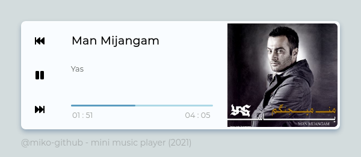
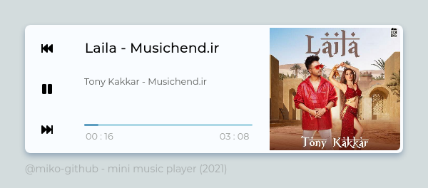

## Mini Music Player

> Sep 6 2021\
> live view : **[codepen](https://codepen.io/miko-github/full/gORYWeQ)**

<!--
Hi there 👋,
if you like my `README.md`, don't worry, use them 🤗
i mean you can copy/paste them 😉
because i love ❤️ opensource, did you like it?
-->
<!-- [![Open Source Love][badge-open-source]][social-github] -->

### Screenshots

> also support drag and drop local sounds

### License & Thanks

powered by [YEK (yek-sass)](https://github.com/yek-org/yek-sass) & [YEK (yek-js)](https://github.com/yek-org/yek-js)\
special thanks to [jsmediatags](https://www.npmjs.com/package/jsmediatags) & [mp3tag.js.org](https://mp3tag.js.org)\
under [MIT](./LICENSE) license
